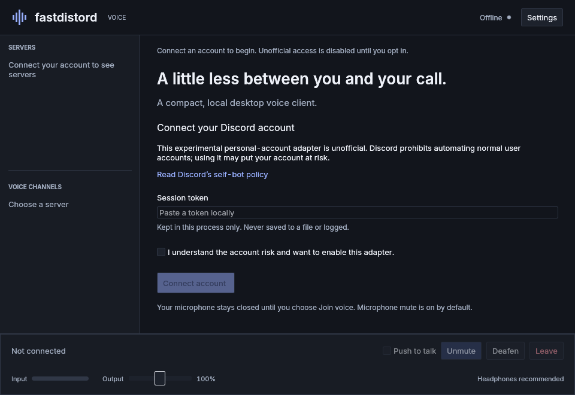

# fastdistord

**Discord voice, in a small native app.** A Rust + fastframe personal-account experiment, with macOS Apple Silicon as the primary target.

[Get started](docs/GETTING_STARTED.md) · [Controls and help](docs/USING.md) · [Verification](docs/VERIFICATION.md) · [Contribute](CONTRIBUTING.md) · [Packaging](PACKAGING.md)



## Before you start

**This is experimental, not a live-validated Discord replacement.** Discord restricts supported personal-user voice authorization to approved partners. The included unofficial adapter is off until you accept its account and maintenance risks locally. It may break or lead to account restrictions. No bot, desktop RPC, browser engine, or official-client fallback is substituted.

There is **no public release, Homebrew cask, Developer-ID-signed download, or notarized Mac app**. The private CI workflow packages macOS Apple Silicon and Linux x86_64 downloads after successful builds. The new artifact-upload steps must finish before those downloads exist; see below. macOS audio, Keychain, shortcuts and real Discord calls still need authorized native testing. Read [what passed and what did not](docs/VERIFICATION.md).

## Voice-first features

- Account, server and voice-channel selection; participants and speaking events
- Two-way CPAL audio through Songbird/Opus and mandatory DAVE encryption
- Mute, deafen, open microphone or hold-to-talk; default muted
- Microphone/speaker selection, input meter and output volume
- Tray-based background calling when supported by the desktop
- Bounded session/device recovery with explicit mute preserved and no fallback microphone
- Optional macOS Keychain storage; no recording or telemetry

Use headphones. Echo cancellation, noise suppression and automatic gain control are not implemented.

## Private build downloads

Open this repository's [Actions](https://github.com/uzgorenm/fastdistord/actions), choose a successful **Check** run for the desired commit, and look under **Artifacts**. You must be signed into GitHub with access to this private repository. Artifacts expire after14days and are development builds, not published releases.

- **macOS Apple Silicon:** download the macOS artifact, unzip it, then unzip `fastdistord-macos-arm64.zip` to obtain `Fastdistord.app`. It is locally ad-hoc signed, not notarized. Native build/signature checks do not prove microphone or live-call behavior.
- **Linux x86_64:** download the Linux artifact, unzip it, extract `fastdistord-linux-x86_64.tar.gz`, then run `./fastdistord`. Built on Ubuntu24.04; requires compatible glibc and ALSA/GUI runtime libraries. It is not a universal AppImage.
- **Windows:** no downloadable build is currently produced or verified.

If the run has no artifacts or is still running, the downloads are not ready. Do not substitute an unverified third-party binary.

## Build and open

Install Rust 1.99.0, CMake and your platform prerequisites from [Getting started](docs/GETTING_STARTED.md#build), then:

```sh
cargo build --locked --release
./target/release/fastdistord
```

For an Apple Silicon app bundle, **run on macOS** with Xcode command-line tools:

```sh
rustup target add aarch64-apple-darwin
./scripts/bundle-macos.sh
open dist/Fastdistord.app
```

The bundle uses a local ad-hoc signature; it is not notarized. See [Packaging](PACKAGING.md).

## Your first call

1. Read and accept the unofficial-access disclosure if you choose to proceed.
2. Enter your credential only in the local password field. Never send it in chat or extract it from another application. Saving to Keychain is optional.
3. Choose an existing server/channel and click **Join**. This opens the selected audio devices; macOS may ask for microphone permission.
4. Confirm encrypted voice readiness, then unmute when ready. With PTT enabled, hold **Ctrl+Shift+Space** or the visible **Talk** button.
5. **Leave** releases audio devices. Window close may retain an active call; **Quit** ends it.

The [first-call walkthrough](docs/GETTING_STARTED.md#account-and-first-call) explains consent and credentials. [Controls and troubleshooting](docs/USING.md) covers shortcuts, reconnecting, devices and background behavior.

## Develop and report problems

Launch without credentials to inspect the real offline UI; it contains no fake account or participant data. See [Contributing](CONTRIBUTING.md) for checks and useful, secret-free bug reports. [Manual acceptance](docs/LIVE_TEST.md) lists the still-required live and hardware tests.

## Acknowledgements

Built on [fastframe](https://github.com/crmne/fastframe), egui/winit, CPAL, Rubato, Songbird/Opus and Davey/OpenMLS. [Spotifast](https://github.com/crmne/spotifast) informed the native-shell architecture and this repository's guide-first organization. Its Spotify-specific services, releases and workflows are not part of this project.

MIT project. The vendored Songbird patch retains its ISC license and [modification notes](vendor/songbird/FASTDISTORD_PATCH.md). This independent project is not affiliated with Discord.
